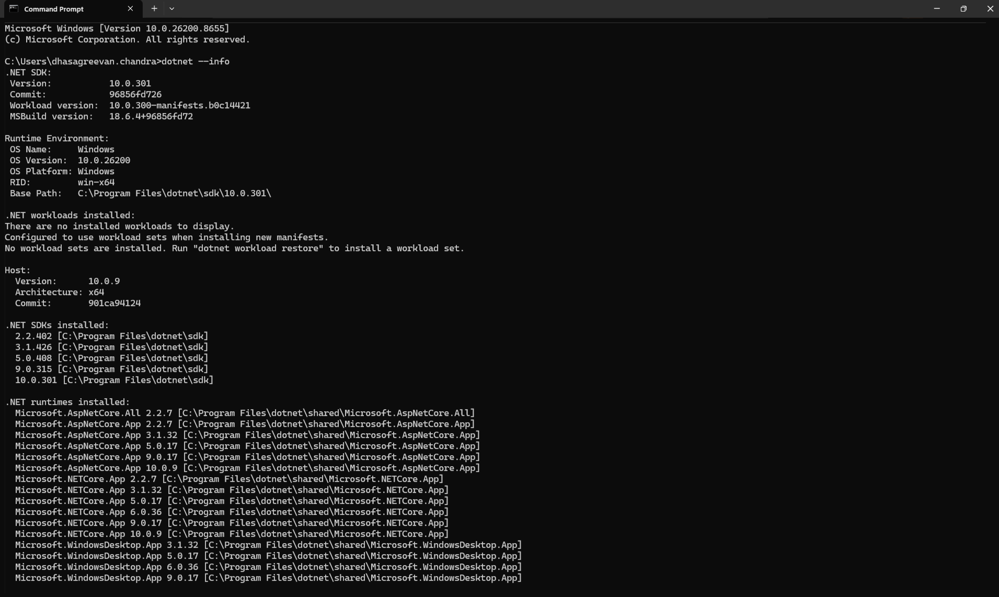
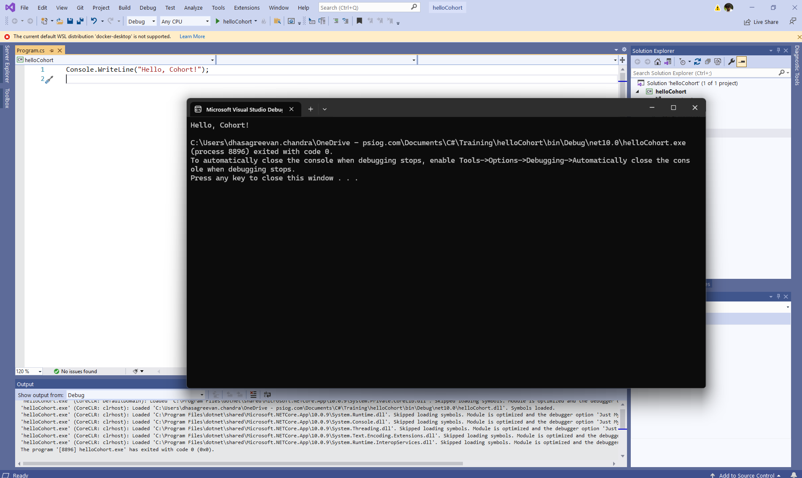
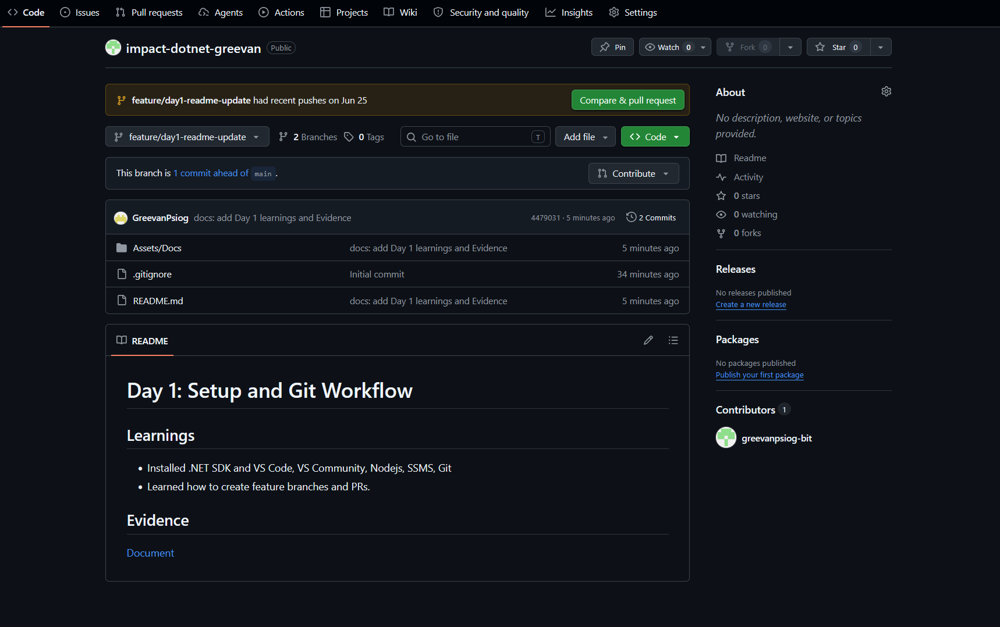

# Day 1: Setup and Git Workflow

## Learnings
- Installed .NET SDK and VS Code, VS Community, Nodejs, SSMS, Git
- Built and ran C# code
- Connected SSMS Db after creation
- Learned how to create feature branches and PRs.

## Evidence

Task 1.1 

Task 1.2

Task 1.3

Task 1.4

# Day 2: Namespaces, Identifiers, Preprocessor
Task 1.5 Create namespace SchoolManagement with a Student class. Call it from Program.cs with and without the using directive. ✓ Done when: both call styles compile and you've noted the difference in a comment.

Task 1.6 Create ModuleA and ModuleB, each with Helper.Greet(). Call both from Main() and resolve the name clash with fully-qualified names. ✓ Done when: both Greet()s run without ambiguity errors.

Task 1.7 Declare 5 variables using correct conventions (camelCase locals, PascalCase types/methods). Try a variable named class, observe the error, fix with @class. ✓ Done when: the @class version compiles and the error is noted.

Task 1.8 Use #define TRIAL_VERSION + #if/#else/#endif to switch a printed message; use #region to group a class into Fields/Properties/Constructors/Methods. ✓ Done when: toggling the #define changes the output.

## Evidence

Task 1.5

Task 1.6

Task 1.8

# Day 3: Enums, Nullable, conversion, Memory model

Task 1.10

Task 1.11

Task 1.12

# Day 4 — Modern Syntax + Class Anatomy

Task 1.13

Task 1.14

