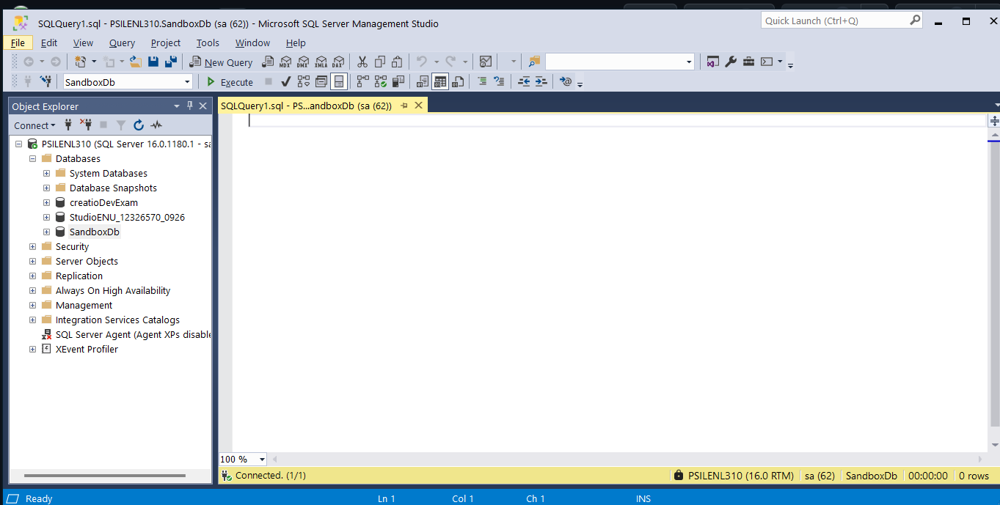

# WEEK 1 — Environment + C# Language & Object Foundations

**Phase 0 + Modules 1–2 · 15 hrs**

### 🎯 Objective
Identical working toolchain for everyone, and fluency with C#'s type system, records, and pattern matching — the vocabulary the rest of the program assumes.

### 📚 Syllabus Covered
* **Module 1:** Namespaces, identifiers, preprocessor directives, value vs reference, enums, nullable, type conversion, dynamic vs var, tuples, pattern matching.
* **Module 2:** Classes/fields/properties/constructors, const vs readonly, partial classes, access modifiers, strings/StringBuilder, records, indexers.

### 💡 Core Concepts
The full C# language surface: types and how they live in memory, the conversion paths, modern syntax (records, tuples, pattern matching), and the anatomy of a class.

> **Fresher catch-up note:** *Modules 1–2 are review for experienced devs. Freshers should treat Days 2–5 as the priority and use any spare evening time to repeat the conversion and pattern-matching tasks.*

---

## 🛠️ Day 1 — Toolchain & Git

| 📝 Learning Notes & "Done When" Criteria | 📸 Evidence |
|---|---|
| **Task 1.1: Toolchain Installation**<br>• Installed VS Community, VS Code, .NET SDK, SQL Server + SSMS, Node.js.<br>• **Done when:** `dotnet --info` prints the SDK version. | **Task 1.1**<br> |
| **Task 1.2: First Console App**<br>• Used `dotnet new console`, built, and ran the app.<br>• **Done when:** Program runs and prints "Hello cohort". | **Task 1.2**<br> |
| **Task 1.3: Git Workflow**<br>• Created `impact-dotnet-<name>` repo, pushed first commit, opened/merged a trivial PR.<br>• **Done when:** Merged PR URL exists. | **Task 1.3**<br> |
| **Task 1.4: Database Setup**<br>• Connected SSMS to local SQL Server.<br>• **Done when:** Screenshot shows connection and `SandboxDb` creation. | **Task 1.4**<br> |

---

## 🏷️ Day 2 — Namespaces, Identifiers, Preprocessor

| 📝 Learning Notes & "Done When" Criteria | 📸 Evidence |
|---|---|
| **Task 1.5: Namespaces**<br>• Created `SchoolManagement` namespace with a `Student` class.<br>• Called from `Program.cs` with and without `using`.<br>• **Done when:** Both compile; difference noted in comments. | **Task 1.5**<br> |
| **Task 1.6: Name Clashes**<br>• Created `ModuleA` and `ModuleB`, both with `Helper.Greet()`.<br>• **Done when:** Resolved ambiguity using fully-qualified names. | **Task 1.6**<br> |
| **Task 1.7: Identifiers & Keywords**<br>• Used `camelCase` for locals, `PascalCase` for types.<br>• **Done when:** Used `@class` to escape a reserved keyword and noted the compiler error. | *(Code committed to repo)* |
| **Task 1.8: Preprocessor Directives**<br>• Used `#define TRIAL_VERSION` with `#if/#else/#endif`.<br>• Used `#region` to group class members.<br>• **Done when:** Toggling `#define` changes console output. | **Task 1.8**<br> |

---

## 🧠 Day 3 — Memory Model, Enums, Nullable, Conversion

| 📝 Learning Notes & "Done When" Criteria | 📸 Evidence |
|---|---|
| **Task 1.9: Memory Model (Value vs Reference)**<br>• Copy-and-modify test: `int`, `int[]`, `Coordinate struct` vs `Coordinate class`.<br>• **Done when:** Comments explain why array/class shared state but int/struct did not. | *(Code committed to repo)* |
| **Task 1.10: Enums & Flags**<br>• `DaysOfWeek` enum mapping 0-6 to names.<br>• `[Flags] FilePermission` combined with `\|` and tested with `&`.<br>• **Done when:** Bitwise operations print correctly. | **Task 1.10**<br> |
| **Task 1.11: Nullable Types**<br>• Used `int?` and `HasValue`.<br>• `ApplyDiscount(double? discount)` defaulting to 5% via `??`.<br>• **Done when:** `null` applies default; value uses provided discount. | **Task 1.11**<br> |
| **Task 1.12: Type Conversion**<br>• Implicit (`int`→`long`→`float`→`double`) vs Explicit (`double`→`int`).<br>• Used `is`, `as`, `Convert.ToInt32`, `int.TryParse`.<br>• **Done when:** Precision loss noted; all 4 approaches run safely. | **Task 1.12**<br> |

---

## 🚀 Day 4 — Modern Syntax + Class Anatomy

| 📝 Learning Notes & "Done When" Criteria | 📸 Evidence |
|---|---|
| **Task 1.13: var vs dynamic**<br>• `var` reassignment compile error vs `dynamic` runtime type changes.<br>• **Done when:** Compile error shown; runtime types printed via `.GetType()`. | **Task 1.13**<br> |
| **Task 1.14: Tuples & Deconstruction**<br>• `GetMinMax` returns named tuple `(int Min, int Max)`.<br>• **Done when:** Tuples returned and deconstructed into separate variables. | **Task 1.14**<br> |
| **Task 1.15: Pattern Matching**<br>• Type patterns (`int`/`string`/`null`), relational switch expressions, property patterns.<br>• **Done when:** Each pattern path prints the correct branch. | **Task 1.15**<br> |
| **Task 1.16: Class Anatomy**<br>• Validated properties, constructor chaining (`: this()`), `const` vs `readonly`.<br>• **Done when:** Validation rejects out-of-range age; chaining works. | **Task 1.16**<br> |

---

## 🧩 Day 5 — Partial, Access, Strings, Records, Indexers + Mini-Projects

| 📝 Learning Notes & "Done When" Criteria | 📸 Evidence |
|---|---|
| **Task 1.17: Core C# Features**<br>• Partial classes/methods, access-modifier matrix.<br>• `Address` record (`==` equality, `with` mutation).<br>• `Playlist` indexers (bounds checking + string indexer).<br>• **Done when:** Record prints `True` for equality; `with` creates changed copy. | **Task 1.17**<br> |
| **Mini Q1: Product Catalog**<br>• `Product` record with `Category` enum.<br>• Grouped 5 objects using LINQ `.GroupBy()`.<br>• **Done when:** Output is grouped correctly by category. | **Mini Q1**<br> | 
| **Mini Q2: Temperature Converter**<br>• Handled value + unit using method overloading.<br>• **Done when:** All three units (C, F, K) convert correctly. | **Mini Q2**<br> |
| **Mini Q3: Contact Card**<br>• Array of 5 `ContactCard` structs.<br>• Case-insensitive search using `StringComparison.OrdinalIgnoreCase`.<br>• **Done when:** Lowercase query finds a differently-cased name. | **Mini Q3**<br> |

---

## 📦 Weekly Deliverable & Submission Checklist

* [x] **Week01 Folder:** All programs above are runnable and committed via ≥1 PR.
* [x] **Learning Document:** Created (.docx/.pdf) covering Learnings (Modules 1 & 2) and Doables (Tasks 1.1 - 1.17 + Minis). Embedded `dotnet --info` and SSMS screenshots.
* [x] **Git Submission:** Repo link and merged PR URL for Week 01 work.
* [x] **Assignments:** Mini-projects (Q1, Q2, Q3) committed and listed.

---

## 🎓 Lessons Learnt
*By the end of this week, I can:*
1. Set up the full .NET toolchain, run a console app, and push work through a GitHub branch + PR.
2. Organise code with namespaces, resolve naming clashes, and use valid identifiers (including `@`-escaping a keyword).
3. Explain how value types and reference types behave differently when copied.
4. Use `[Flags]` enums with bitwise operators, handle nullable values with `??`, and convert types four ways (`is`/`as`/`Convert`/`TryParse`).
5. Choose between `var` and `dynamic`, return and deconstruct tuples, and branch with pattern matching.
6. Build classes with validated properties, value-equality records (`with`), and indexers.
7. **Shipped:** Product Catalog, Temperature Converter, and Contact Card.

# Week 2 — OOP, Delegates, Events, Generics & LINQ
##  Objective
Model a domain with proper OOP and query collections fluently — the two skills the Web API leans on hardest.

### 📚 Syllabus Covered
- **Module 3:** Encapsulation, inheritance, overriding, abstract classes, interfaces, polymorphism, method hiding (`new`), operator overloading.
- **Module 4:** Delegates, events, lambdas, `Action`/`Func`/`Predicate`.
- **Module 5:** Generics, `IEnumerable`/`yield`, LINQ (query & method syntax), extension methods, anonymous types.


---

## Section A — Learnings
## Day 1 — Encapsulation, Inheritance, Overriding


## Day 2 — Abstract, Interfaces, Polymorphism, Hiding, Operators


## Days 3 - 


## Day 4 - 


### Module 3: OOP Pillars & Advanced Class Design
This module solidified the four pillars of OOP through practical implementation. I learned to enforce invariants using encapsulation with private fields and validation logic, ensuring objects never enter invalid states. Multi-level inheritance was mastered through constructor chaining (`base(...)`), understanding how initialization flows from base to derived classes. The distinction between `virtual/override` and `sealed override` became clear when preventing further inheritance of specific behaviors. Abstract classes vs. interfaces were differentiated by their purpose: abstract classes define *what* something is (shared identity + partial implementation), while interfaces define *what* something can do (capabilities). Method hiding (`new`) versus overriding (`override`) was clarified through runtime polymorphism tests, showing how reference type determines which method executes. Operator overloading for custom types like `Money` demonstrated making domain objects behave naturally with standard operators.


### Module 4: Delegates, Events & Functional Patterns
Delegates were understood as type-safe function pointers enabling callback patterns without tight coupling. Multicast delegates showed how multiple subscribers can be invoked sequentially, forming the basis of event systems. Custom `EventArgs` classes taught me to pass contextual data through events while maintaining type safety. The `Action`, `Func`, and `Predicate` generic delegates replaced custom delegate declarations for common patterns, reducing boilerplate. Lambda expressions provided concise inline implementations for these delegates. The pub-sub pattern via events decoupled publishers from subscribers completely — the publisher knows nothing about who receives notifications, only that they conform to the event signature. This separation is foundational for building maintainable, testable systems.

### Module 5: Generics, Iterators & LINQ
Generics enabled writing reusable, type-safe collections and repositories without sacrificing compile-time checking. The `where T : class, new()` constraint pattern ensures only reference types with parameterless constructors can use certain functionality. Lazy evaluation through `yield return` transformed how I think about iteration — sequences are computed on-demand rather than materialized upfront, critical for memory efficiency with large datasets. LINQ's dual syntax (query expression vs. method chain) offers flexibility: query syntax reads like SQL for complex joins/grouping, while method syntax integrates seamlessly with C# code and supports dynamic composition. Extension methods allow adding functionality to existing types without modification, adhering to the Open/Closed Principle. Anonymous types provide lightweight projections for intermediate transformations, though their scope limitation (cannot be returned from methods) requires planning for DTOs or records when data must cross boundaries.

---

## Section B — Doables

| Task | Done When Outcome | Evidence |
|------|-------------------|----------|
| **2.1 BankAccount** | Overdraw rejected; history logs every operation including failures | *(Code committed to repo)* |
| **2.2 Vehicle Inheritance** | Constructor chain runs top-to-bottom; each override prints own info | *(Code committed to repo)* |
| **2.3 Sealed Override** | Compile error captured when attempting to override sealed method | *(Code committed to repo)* |
| **2.4 Abstract Shape** | Circle/Rectangle compute area; `new Shape()` instantiation error shown | *(Code committed to repo)* |
| **2.5 Multiple Interfaces** | Single class implements both `IShape` and `IDrawable` without conflict | *(Code committed to repo)* |
| **2.6 Overloading & Hiding** | Runtime polymorphism picks correct area; `new` vs `override` behavior documented | *(Code committed to repo)* |
| **2.7 Money Operators** | Mismatched currency addition throws; comparisons return correct results | *(Code committed to repo)* |
| **2.8 MathOperation Delegate** | Multicast invokes both methods; `Func` version matches output | *(Code committed to repo)* |
| **2.9 AlarmClock Event** | Triggering alarm notifies Person AND CoffeeMachine with exact time | *(Code committed to repo)* |
| **2.10 Action/Func/Predicate Pipeline** | Filter evens → square → print produces expected sequence | *(Code committed to repo)* |
| **2.11 Generic Repository<T>** | Same repo works for Student and Product; constraint rationale explained | *(Code committed to repo)* |
| **2.12 Lazy Iteration (yield)** | Iterator consumed lazily in foreach; not materialized upfront | *(Code committed to repo)* |
| **2.13 LINQ Dual Syntax** | Every query written in BOTH query AND method syntax with identical results | *(Code committed to repo)* |
| **2.14 Extensions & Anonymous Types** | All three extensions pass; anonymous type return limitation explained | *(Code committed to repo)* |
| **Mini Q4: Employee Payroll** | Total payroll correct; per-department grouping prints accurately | *(Code committed to repo)* |
| **Mini Q5: Notification Engine** | Sending notification fires event; logs from all subscribers appear | *(Code committed to repo)* |
| **Mini Q6: Library Management** | All four LINQ queries return verified correct results | *(Code committed to repo)* |

---

## 💡 Key Learning Note: LINQ Query That Took Most Tries

**Task 2.13 – GroupBy Department with Count + Average Salary**

The most challenging query was grouping employees by department while calculating both count and average salary, then projecting to an anonymous type. Initially, I tried to access `g.Average()` inside the select clause without properly scoping the group variable.

**Query Syntax:**
```csharp
var deptStats = from emp in employees
                group emp by emp.Department into g
                select new 
                {
                    Department = g.Key,
                    Count = g.Count(),
                    AvgSalary = g.Average(e => e.Salary)
                };