# WEEK 2 — OOP, Delegates, Events, Generics & LINQ

**Modules 3–5 · 15 hrs**

### 🎯 Objective
Model a domain with proper OOP and query collections fluently — the two skills the Web API leans on hardest.

### 📚 Syllabus Covered
* **Module 3:** Encapsulation, inheritance, overriding, abstract classes, interfaces, polymorphism, method hiding (`new`), operator overloading.
* **Module 4:** Delegates, events, lambdas, `Action`/`Func`/`Predicate`.
* **Module 5:** Generics, `IEnumerable`/`yield`, LINQ (query & method syntax), extension methods, anonymous types.

### 💡 Core Concepts
The four OOP pillars in code, callback/pub-sub via delegates and events, and type-safe reusable collections with LINQ querying.

> **Fresher catch-up note:** *This week runs at the experienced-cohort pace. Freshers should prioritise the coding tasks over reading, repeat the LINQ tasks in spare evening time, and lean on pairing during the OOP days.*

---

## 🏛️ Day 1 — Encapsulation, Inheritance, Overriding

| 📝 Learning Notes & "Done When" Criteria | 📸 Evidence |
|---|---|
| **Task 2.1: BankAccount Encapsulation** • Private balance; Deposit/Withdraw/GetBalance with validation. • Private history list + PrintHistory(). • **Done when:** An overdraw is rejected and the history logs every operation. | **Task 2.1** 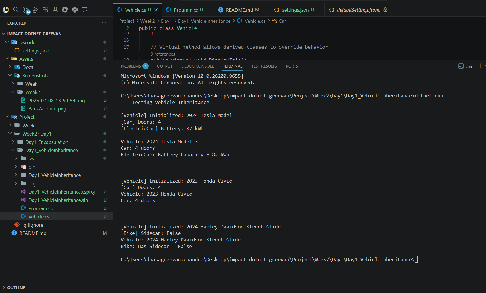 |
| **Task 2.2: Inheritance & Constructor Chaining** • `Vehicle` → `Car`/`Bike` overrides. • `ElectricCar : Car` with `: base(...)` chain. • **Done when:** Constructor chain runs top-to-bottom; each override prints its own info. | **Task 2.2** 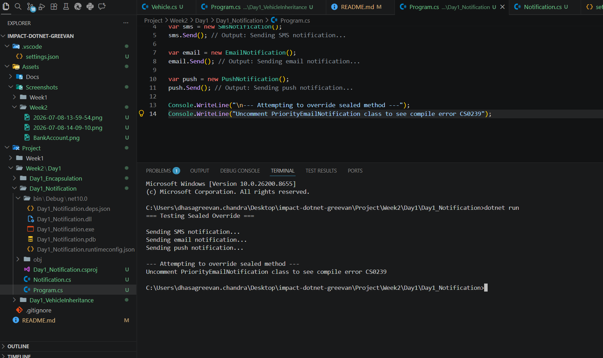 |
| **Task 2.3: Virtual, Override & Sealed** • `Notification.Send()` virtual → Email/Sms/Push overrides. • `EmailNotification.Send()` marked `sealed`. • **Done when:** The sealed-override compile error is captured. | *(Code committed to repo)* |

---

## 🧩 Day 2 — Abstract, Interfaces, Polymorphism, Hiding, Operators

| 📝 Learning Notes & "Done When" Criteria | 📸 Evidence |
|---|---|
| **Task 2.4: Abstract Classes** • Abstract `Shape` with `CalculateArea()`. • `Circle`/`Rectangle` implementations. • **Done when:** Both shapes compute area and the `new Shape()` instantiation error is shown. | **Task 2.4** 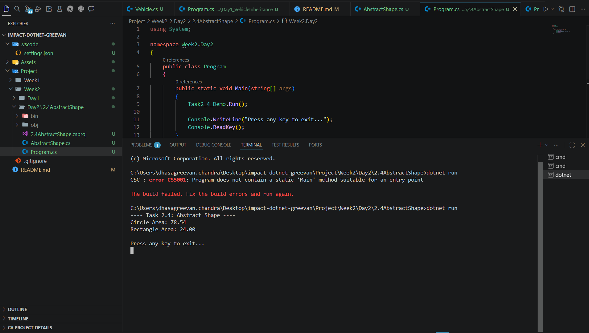 |
| **Task 2.5: Multiple Interfaces** • `IShape` + `IDrawable` implemented in one class. • **Done when:** One class satisfies both interfaces; interface-vs-abstract comment block added. | **Task 2.5** 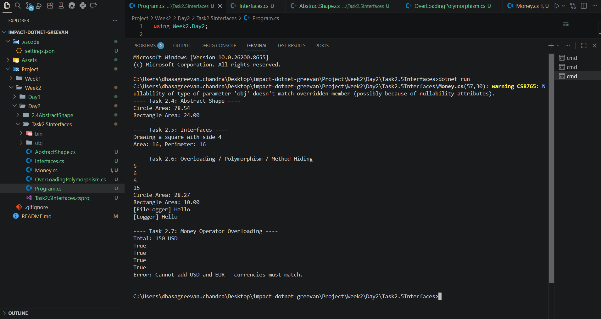 |
| **Task 2.6: Polymorphism & Method Hiding** • Overloaded `Calculator.Add()`. • `List<Shape>` loop calling correct `CalculateArea()`. • `Logger.Log()` vs `FileLogger.Log()` using `new`. • **Done when:** Runtime polymorphism picks derived area; `new` vs `override` behavior documented. | **Task 2.6** 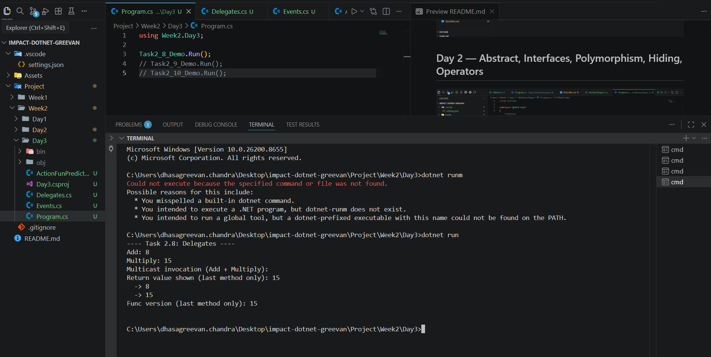 |
| **Task 2.7: Operator Overloading** • `Money` struct: overload `+`, `==`, `!=`, `>`, `<`. • **Done when:** Mismatched-currency addition throws exception; comparisons return correct results. | **Task 2.7** 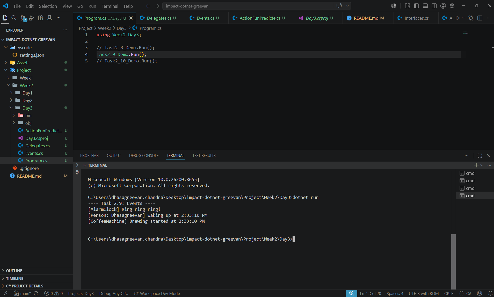 |

---

## 🔔 Day 3 — Delegates & Events

| 📝 Learning Notes & "Done When" Criteria | 📸 Evidence |
|---|---|
| **Task 2.8: Delegates & Multicast** • `MathOperation` delegate with Add/Sub/Mult/Div. • Multicast invocation + `Func<double,double,double>` rewrite. • **Done when:** Multicast runs both methods; Func version matches output. | **Task 2.8** 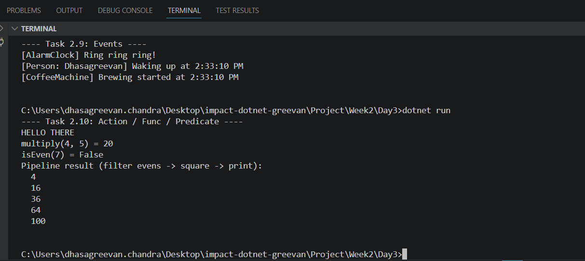 |
| **Task 2.9: Events & Custom EventArgs** • `AlarmClock.OnAlarmRing` event. • Subscribers: `Person` and `CoffeeMachine`. • Custom `AlarmEventArgs` with `DateTime`. • **Done when:** Triggering alarm notifies both subscribers with time. | **Task 2.9** 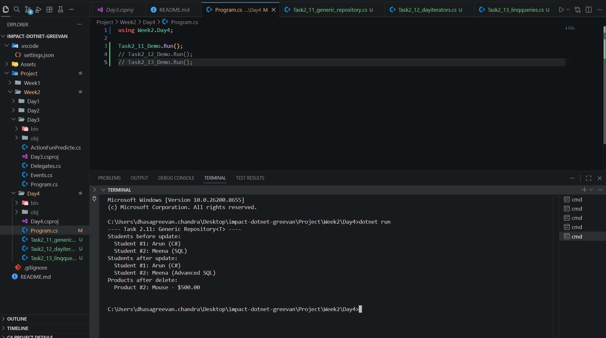 |
| **Task 2.10: Action, Func, Predicate** • `ProcessList` method: Filter (Predicate) → Transform (Func) → Output (Action). • **Done when:** Filtering evens → squaring → printing produces expected sequence. | **Task 2.10** 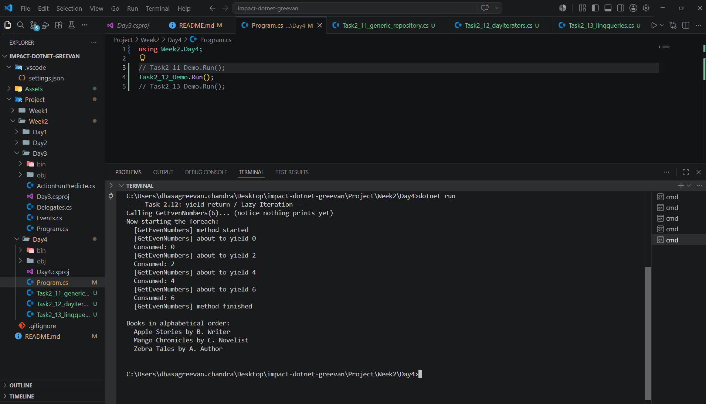 |

---

## 📦 Day 4 — Generics, yield, LINQ

| 📝 Learning Notes & "Done When" Criteria | 📸 Evidence |
|---|---|
| **Task 2.11: Generic Repository** • `Repository<T>` with Add/Update/Delete/GetAll. • Tested with `Student` and `Product`. • Constraint `where T : class, new()` explained. • **Done when:** Same repo works for two types; constraint logic explained. | **Task 2.11** 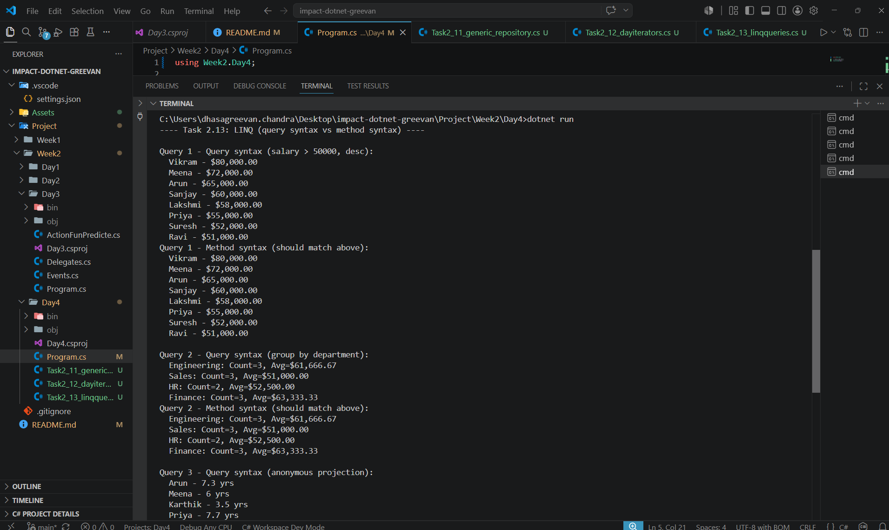 |
| **Task 2.12: IEnumerable & Yield** • `GetEvenNumbers` with `yield return`. • `BookCollection : IEnumerable<Book>` yielding alphabetically. • **Done when:** Iterator is consumed lazily in a `foreach`. | **Task 2.12** 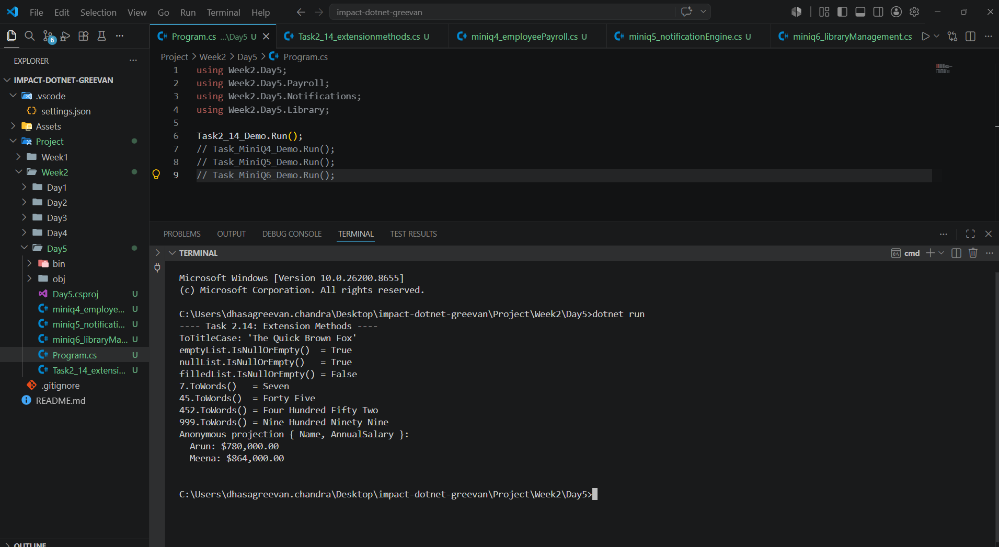 |
| **Task 2.13: LINQ Queries (Dual Syntax)** • Employee list (10+ rows): Filter, Order, GroupBy, Project. • Written in both Query and Method syntax. • **Done when:** Every query is written twice and returns identical results. | **Task 2.13** 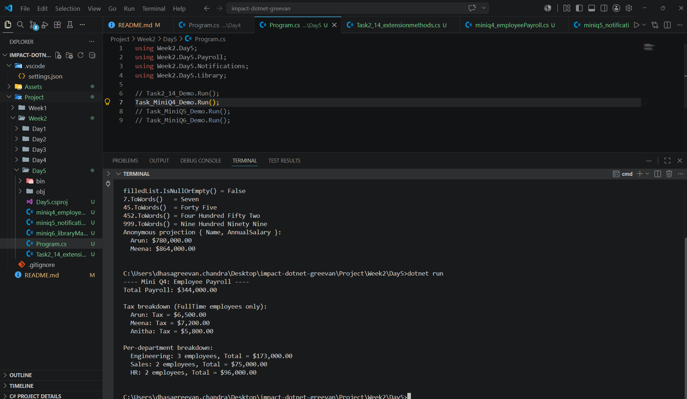 |

---

## 🚀 Day 5 — Extensions, Anonymous Types + Mini-Projects

| 📝 Learning Notes & "Done When" Criteria | 📸 Evidence |
|---|---|
| **Task 2.14: Extension Methods & Anonymous Types** • Extensions: `ToTitleCase()`, `IsNullOrEmpty()`, `ToWords()`. • Project Employee to anonymous type. • **Done when:** All three extensions pass examples; anonymous type limitation noted. | **Task 2.14** 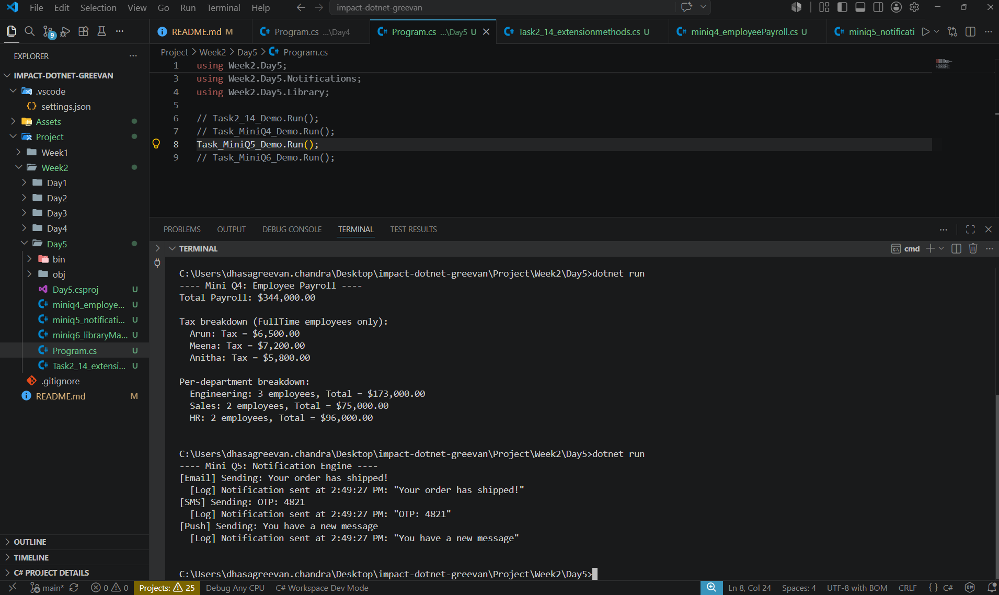 |
| **Mini Q4: Employee Payroll** • Abstract `Employee.CalculateSalary()`. • FullTime/PartTime/Contract implementations. • `ITaxable` on FullTime only. • LINQ GroupBy department. • **Done when:** Total payroll is correct; per-department grouping prints. | **Mini Q4**  |
| **Mini Q5: Notification Engine** • Delegate-based sender (Email/Sms/Push). • `NotificationService.OnNotificationSent` event. • **Done when:** Sending a notification fires the event and logs it. | **Mini Q5**  |
| **Mini Q6: Library Management (LINQ)** • 15+ Books: Available by author, Group by genre, Oldest book, Post-2010 sorted. • **Done when:** All four queries return correct results. | **Mini Q6**  |

---

## 📦 Weekly Deliverable & Submission Checklist

* [x] **Week02 Folder:** All OOP exercises + three mini-projects are runnable and committed via ≥1 PR.
* [x] **Learning Document:** Created (.docx/.md) covering Learnings (Modules 3, 4, 5) and Doables (Tasks 2.1 - 2.14 + Minis). Embedded screenshots of key tasks.
* [x] **Git Submission:** Repo link and merged PR URL for Week 02 work.
* [x] **Assignments:** Mini-projects (Q4, Q5, Q6) committed and listed.

---

## 🎓 Lessons Learnt
*By the end of this week, I can:*
1. Enforce invariants with encapsulation and build multi-level inheritance with constructor chaining.
2. Control overriding with `virtual`/`override`/`sealed`, and explain why an abstract class can't be instantiated.
3. Implement multiple interfaces on one class and watch runtime polymorphism pick the right method.
4. Overload operators, and explain method hiding (`new`) versus `override`.
5. Use delegates, multicast, events with custom `EventArgs`, and `Action`/`Func`/`Predicate`.
6. Write reusable generics, lazy iterators with `yield`, and LINQ queries in both query and method syntax.
7. Add extension methods and use anonymous types.
8. **Shipped:** Employee Payroll, Notification Engine, and Library Management (LINQ).